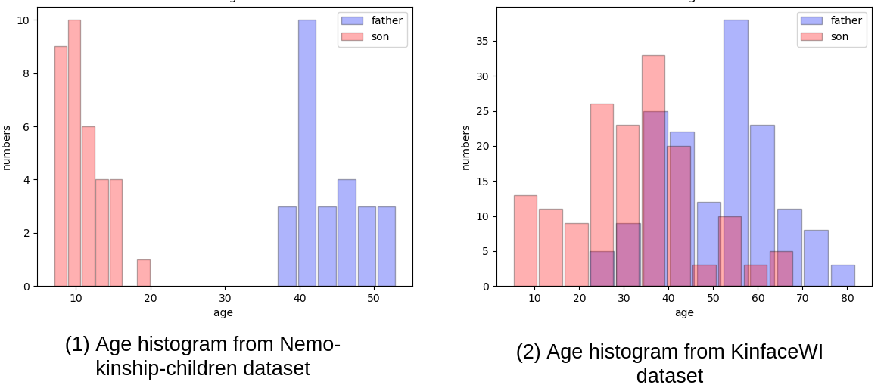
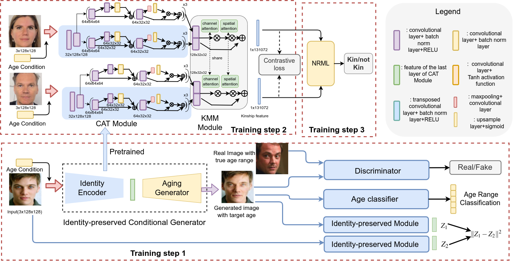

# CATNet


## 1. Nemo-Kinship-Children Dataset

### 1.1 Comparison of age histogram of different datasets

<p align="center">
  
</p>

## 2. Structure of CATNet

<p align="center">
  
</p>


## 3. Training of Generator
The IPCGANs-pytorch can be found [here](https://github.com/guyuchao/IPCGANs-Pytorch)
### 3.1 Data Preparation 
  1. Download the [cacd-2000](https://bcsiriuschen.github.io/CARC/) datasets
  2. run preprocess/preprocess_cacd.py
  3. run preprocess/gentraingroup.py

### 3.1 Training related networks
1.  pretain age classifier

``` python
python pretrain_alexnet.py
```
2. pretrain generator

``` python
python IPCGANS_train.py
```

## 4. Training the baselines
### 4.1  train & test attention network

``` python
python train_attenNet.py
```
The 5-cross validation results can be check in the tensorboard

### 4.2 train & test CNN network
``` python
python train_cnn.py
```
The 5-cross validation results can be check in the tensorboard

## 5. train & test our propsed method
  
  1. train CATNet
  
``` python
python train_CATNet.py

```
  2. get related feature (.mat)
  
``` python
python utils/extract_gfeature.py

```
  3. run NRML
  
``` matlab
run the contrastive_nrml.m using MATLAB

```

  

